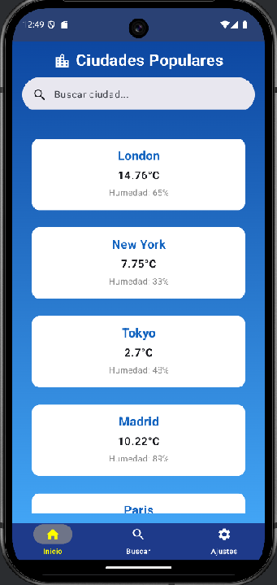
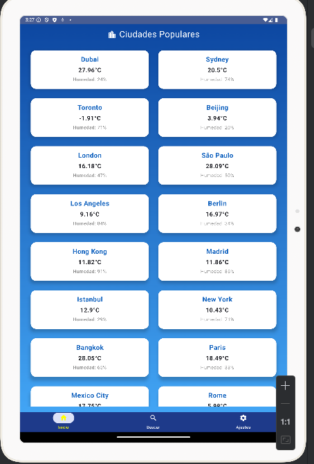
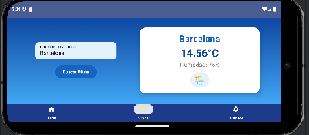
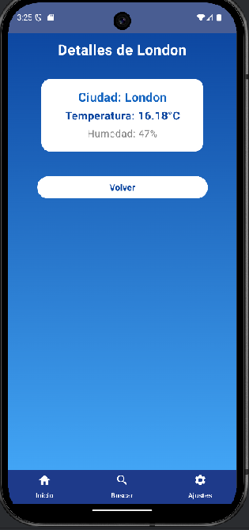
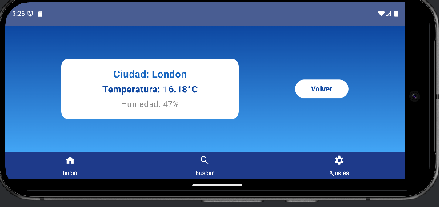
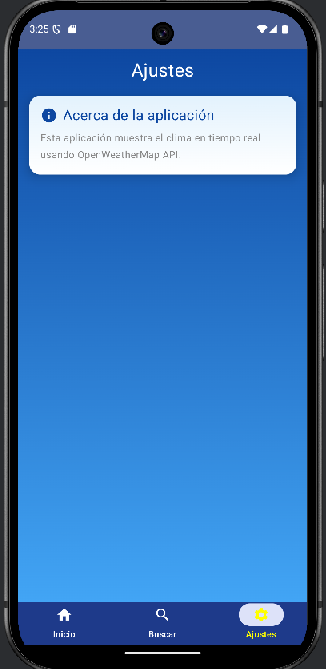
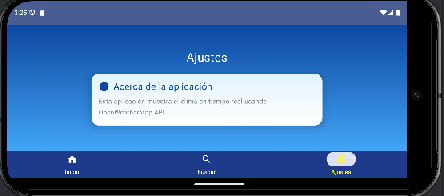

# 🌦️ Weather App - Aplicación de Clima con Jetpack Compose 🚀

 <!-- Cambia por tu imagen principal -->

## 📖 Descripción
Esta aplicación de clima desarrollada con **Jetpack Compose** y arquitectura **MVVM** permite obtener información del clima en tiempo real a través de la API de **OpenWeatherMap**. Además, integra **Room Database** para almacenar búsquedas recientes y cargarlas sin conexión. 

🔥 **Diseñada para ser completamente responsive y adaptativa** usando `WindowSizeClass`, por lo que funciona perfectamente en móviles 📱, tablets 🏢 y pantallas grandes 🖥️.

---

## 🛠️ **Tecnologías Utilizadas**
✅ **Kotlin** - Lenguaje principal  
✅ **Jetpack Compose** - UI moderna y declarativa  
✅ **MVVM** - Arquitectura modular y escalable  
✅ **Retrofit** - Consumo de API REST  
✅ **Room Database** - Persistencia de datos offline  
✅ **Navigation Component** - Navegación entre pantallas  
✅ **LiveData & State** - Gestión reactiva de datos  
✅ **Material 3** - Diseño atractivo y moderno  
✅ **WindowSizeClass** - Diseño responsive y adaptativo  

---

## 📸 **Capturas de Pantalla**

| 📱 Vertical | 🌐 Horizontal | 💻 Tablet |
|------------|-------------|-----------|
|  |  |  |
|  |  |  |
|  |  |  |
|  |  |  |

🚀 **Imágenes de la aplicación en distintos dispositivos y orientaciones.**  
💡 *Puedes reemplazar los enlaces con imágenes subidas a tu repositorio o a un servicio de imágenes como Imgur.*  

---

## 📌 **Características Principales**
✨ **Clima en tiempo real** con datos actualizados de OpenWeatherMap  
🗺️ **Búsqueda de ciudades** con un campo de entrada interactivo  
💾 **Persistencia con Room Database** para acceder a datos sin conexión  
📱 **Diseño 100% responsive y adaptativo** con `WindowSizeClass`  
🚀 **Rápido y eficiente** gracias a `LiveData`, `State` y `Coroutines`  
🔍 **Historial de búsquedas** (opcional)  

---
WeatherApp/
│── api/              # Retrofit para llamadas a la API
│── model/            # Modelos de datos y entidades de Room
│── repository/       # Repositorio para manejar datos de API y Room
│── room/             # Base de datos con DAO y configuración de Room
│── view/             # Pantallas de la aplicación en Jetpack Compose
│── viewmodel/        # ViewModels para manejar lógica de UI
│── navigation/       # Rutas de navegación con Navigation Component

🌍 Cómo Funciona
1️⃣ El usuario busca una ciudad en SearchScreen.
2️⃣ Se obtiene el clima de la API con Retrofit.
3️⃣ Los datos se guardan en Room para persistencia offline.
4️⃣ Si el usuario abre la app sin internet, los datos se cargan desde Room.
5️⃣ Interfaz adaptativa usando WindowSizeClass para distintos tamaños de pantalla.

🛠️ Mejoras Futuras
🚀 Modo oscuro 🌙 con Material 3
📍 Ubicación automática para obtener el clima actual
🌡️ Más detalles meteorológicos como viento y sensación térmica
